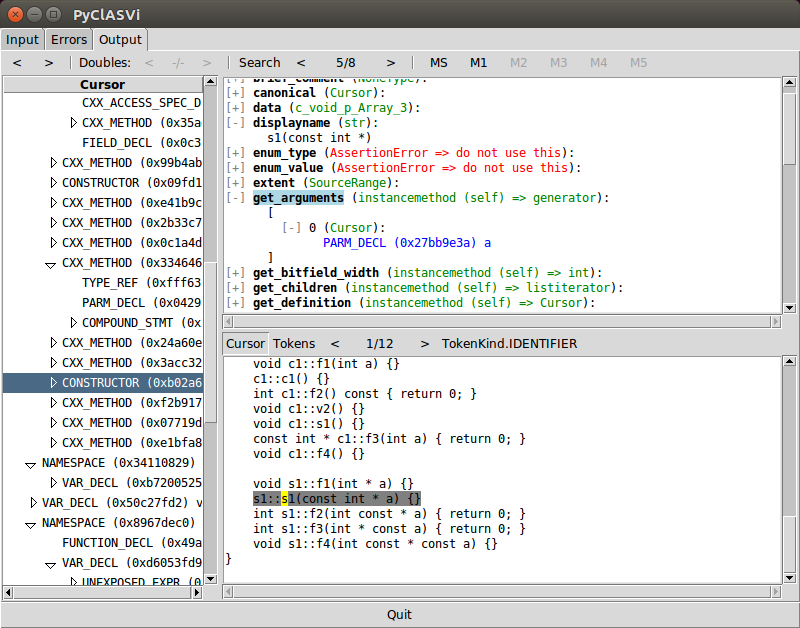
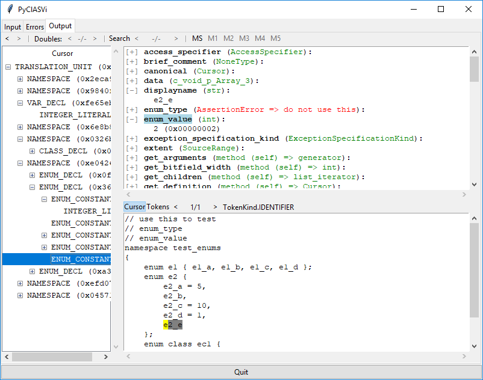

# PyClASVi - Python Clang AST Viewer

**Python Clang AST Viewer is a simple GUI program helping you to understand the Clang Abstract Syntax Tree**

This tool is helpful if you want to use the Python binding for clang library, e.g. for a code generator.
This binding use the c interface (not c++). So if you plan to use the c interface PyClASVi may also help you
but be award the python binding may have some differences.

The goal is to make this program runable on all systems supported by Clang and Python
independent of Clang and Python version or support at least as many different versions as possible.
Currently PyClASVi is tested under Ubuntu and Windows 10 with Python 2.7 and Python 3
using different Clang versions starting at 3.3.
Not all combinations are tested but I thing it works nearly everywhere with nearly every versions.

## Getting Started

Depending on your operation system you need to install different things like:

* Python
* tk for Python
* Clang or just the library
* Compiler with standard header
* Clang Python binding

### Linux

This was tested with Ubuntu 14.04 and 16.04.

First you need to install Clang, Clang Indexing Library Bindings for Python and tk for Python.

For Python 2 you can run this:

    sudo apt-get install libclang1-3.8 python-clang-3.8 python-tk

For Python 3 you can run this:

    sudo apt-get install clang-3.8 python3-pip python3-tk
    sudo pip3 install libclang-py3==3.8

Instead of `libclang1-3.8` you can install the complete compiler using `clang-3.8`
and of course you can use everey supported version.

Now you can run the file `pyclasvi.py` but you may get an error.
Clang Python binding is looking for `libclang.so` or `libclang-<version>.so`
but Ubuntu install something like `libclang.so.1` or `libclang-3.8.so.1`.
Use the `-l` option to set the used library. This is also fine if you have differed versions installed.

To run PyClASVi just call `./pyclasvi.py -l /usr/lib/llvm-3.8/lib/libclang.so.1`.

You will see a tabbed window. The first tab is the Input frame.
Select a file to parse and add some arguments for the Clang parser.
There must be only one argument per line.
It looks like you need also the standard includes like `-I/usr/include` and `-I/usr/include/clang/3.8/include`.

Press `[Parse]` to start the parser.

If all works fine there is no warning or error on the Error tab and the Output tab shows the AST on the left.
Select one entry (Clang calls it Cursor) to find more information on the right.

### Windows

First download and install Python (<http://www.python.org>). Do not use the embeddable zip file, it does not include Tcl/tk.

Also download and install Clang as part of the LLVM project (<http://llvm.org/>).
If you check the option to set the PATH variable you don't need to do it later.
LLVM do not install any standard libraries or headers so you need to install an extra compiler.
As default VisualSudio is used.

To run PyClASVi enter the following commands:

    set PATH=%PATH%;C:\Program Files\LLVM\bin
    py pyclasvi.py

You don't need the first line if you checked the corresponding option while installing LLVM.

## Documentation

[How to use Python Clang AST Viewer](doc/PyClASVi_usage.md)

[How to use Python Clang](doc/python_clang_usage.md)

## License

PyClASVi is distributed under the [MIT License](LICENSE).
